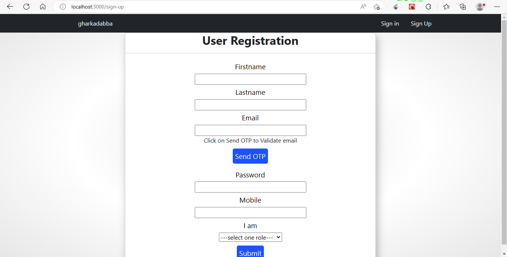
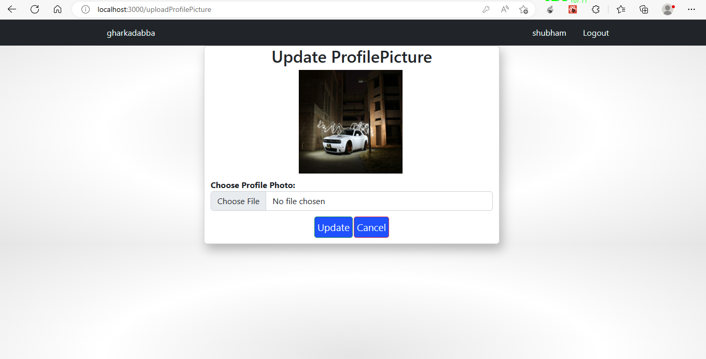
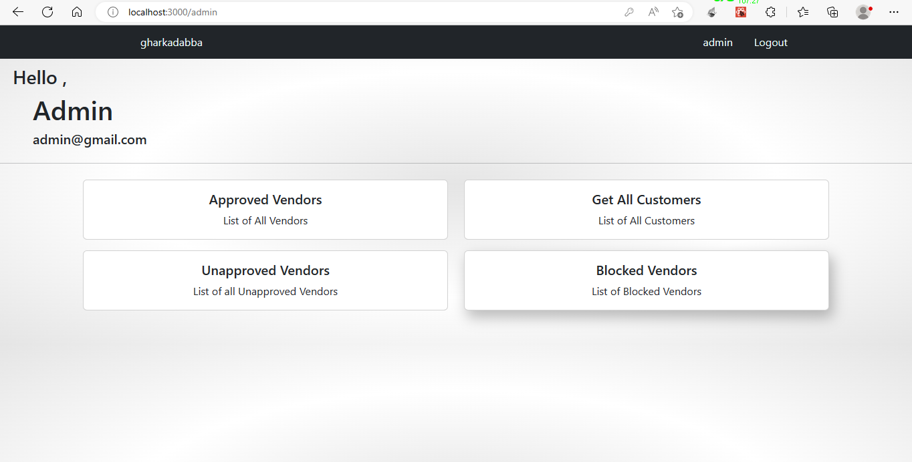

# Ghar Ka Dabba - An Online Tiffin Service
The Online tiffin service 'Ghar Ka Dabba' website is intended to provide complete solution for Vendors, Customer as well as Internal users (Staff) as a single Gateway using internet. Vendors could be anyone who want to setup their tiffin service centre but don’t have platform for the same specially housewife’s who wish have a source of side income. It will enable vendors to provide tiffin service online, consumers to browse through all the available tiffin service and order tiffin without physically visiting the tiffin service centre.

<!-- <a href="" target="_blank">Visit Website</a> 
<a href="" target="_blank">Check Rest API</a>  -->

# Features
1. JWT based Authentication
2. Role based user Authorization
3. Restful Web Service
4. Single Page Application

## Approach Used
1. Code First
2. Reactive(Declarative) Programming
3. KISS
4. DRY

## Platform used

  &emsp;
  &emsp;
  &emsp;
  &emsp;
  &emsp;
  &emsp;
  &emsp;
  &emsp;
  

 

1. JDK-11
2. Maven 4.0.0
3. Springframework 2.7.8
4. Spring Boot Web
5. Spring Security 
6. Spring Data JPA
7. React 18.2.0
8. React-Router-Dom 6.8.2

<!--
## Prerequisites to start Application on your machine
1. Gmail App Password
2. JDK-11 or latest
3. MySQL
4. Maven
5. Nodejs
6. React App -->

## Screenshots
- Home Page / Landing Page  

- Sign Up Page 

- New User need to verify email otherwise cannot proceed 

- Need Step in Sign up is to add address

 
- Signin / Login Page 

 
- Forgot Password Page

- Change Password Page

- Modifying URL to access UnAuthorized Section 

- Vendor Main Page

- Edit Profile Page (Common for Vendor and Customer Role)

- Edit Profile Page [Update Basic Info ] (Common for Vendor and Customer Role)

 
- Edit Profile Page [Update Address ] (Common for Vendor and Customer Role)

- Edit Profile Page [Update Profile Picture ] (Common for Vendor and Customer Role)

- Vendor Add New Subscription Page

- Vendor Edit Existing Subscription Page

- Vendor Details Page Containing List of Avaliable Subscription Plans (Can Be Accessed By Anyone)

- Subscription Plan Details Page Containing List of tiffins (Can Be Accessed By Anyone, Purchase functionality only avaliable to Customer Role)

- Tiffin Details Page

- Customer Main Page
 
 
 
- Customer Place Order for Subscription Plan (Payment API Integration pending)

- Customer Order Place Successfull

- Admin Main Page

- Newly Registered Vendors Should be Approved first by Admin (Only Approved Vendors are displayed on Home Page)

 
- Admin can view all Approved Vendors

- Admin can view all Blocked Vendors

## Future Scope
    
1. Location API Integration
2. Payment API Integration
3. WhatsApp Business API Integration
4. Client & Server Side Validation

## Support

For support, email gudekarshubham@gmail.com

